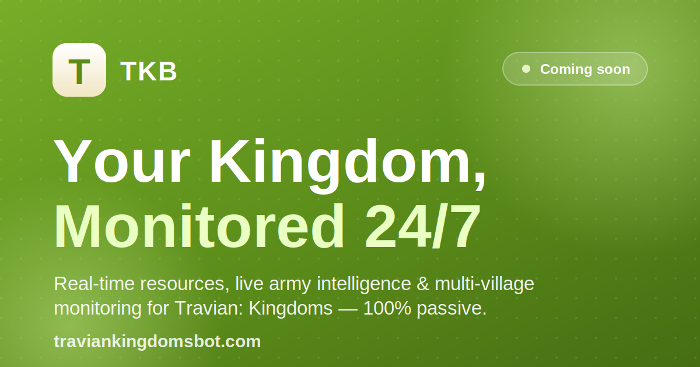
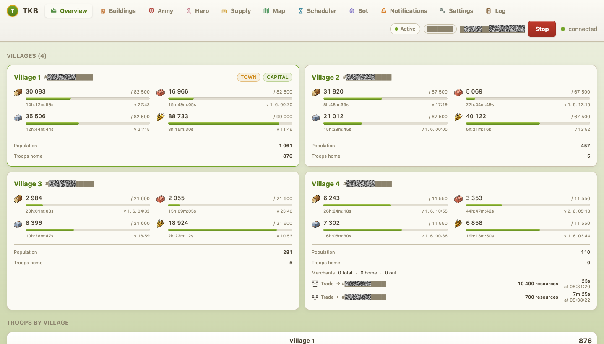
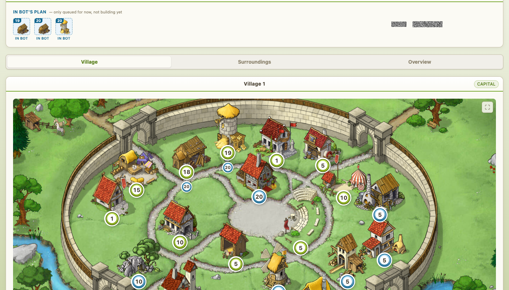
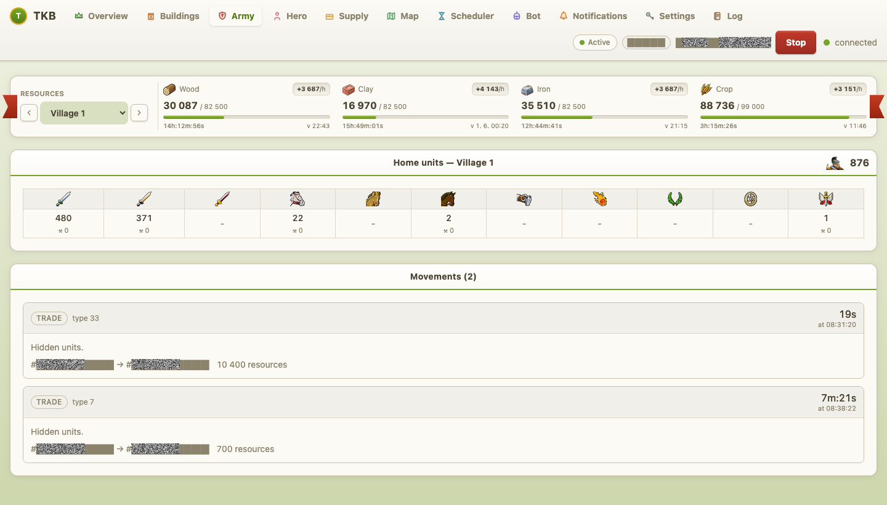
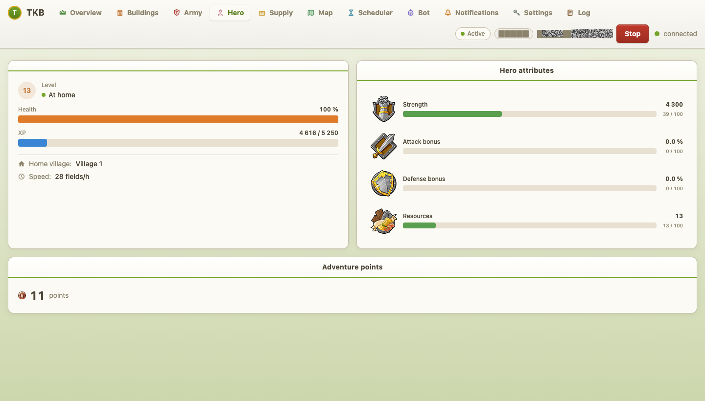
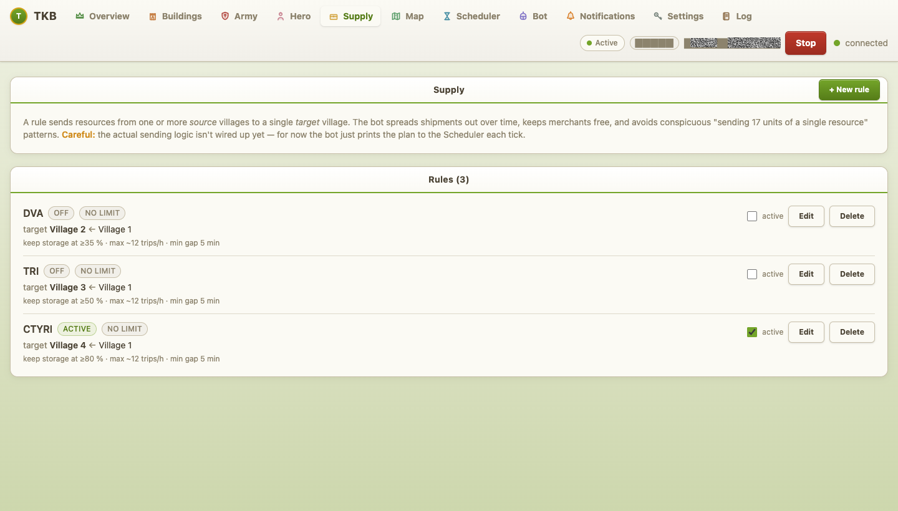
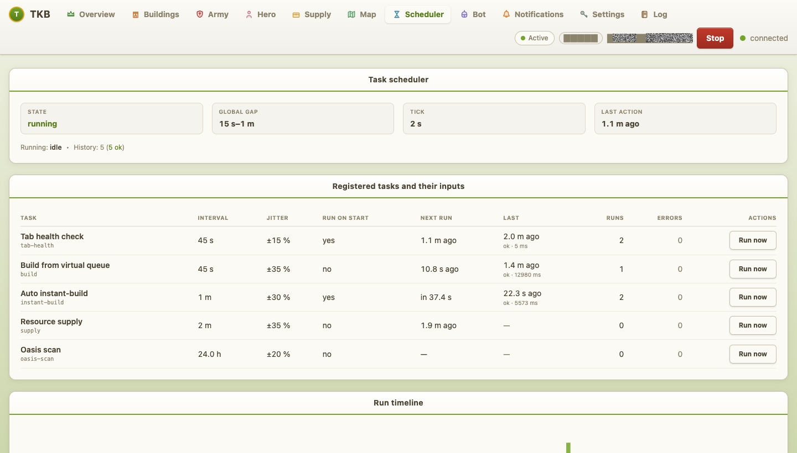

# 🏰 TKB — Travian Kingdoms Bot

### Run Travian: Kingdoms on autopilot.

**TKB builds your villages, ships resources between them, and watches your whole
empire — 24/7, invisibly, while you sleep.**

 

## 👉 Get it at **[traviankingdomsbot.com](https://traviankingdomsbot.com?utm_source=github&utm_medium=readme)** 👈

 

---

## What is TKB?

**TKB (Travian Kingdoms Bot)** is an automation and monitoring tool for
[**Travian: Kingdoms**](https://kingdoms.com). It quietly runs a browser session
in the background, reads the game's own network traffic, and turns it into a
clean, real-time dashboard — while automating the boring grind for you.

You set your plan once. TKB does the clicking, the hauling, and the watching.

> ⚙️ **It doesn't just monitor — it plays the economy for you.** Building queues,
> resource supply between villages, free instant-finishes, oasis scouting — all
> handled automatically, around the clock.

### 🔒 Built to stay invisible
TKB **only reads traffic your browser already receives** — zero extra requests to
Travian's servers, no DOM clicking, no fake keystrokes. Every action it *does*
take is wrapped in randomized, human-like timing. Everything runs **locally on
your machine** — your credentials and game data never leave your network.

---

## ⭐ What it does for you

| | Feature | What you get |
| :-: | --- | --- |
| 🏗️ | **Automated Building Queue** | Set your build plan once — TKB drains it into the game and grabs free instant-finishes the moment they appear. |
| 🚚 | **Auto Resource Supply** | Keeps every village stocked by auto-dispatching merchants — by percentage, fixed rate, or target amount. |
| 📊 | **Real-Time Resources** | Wood, clay, iron & crop for every village, updated to the second — production, fill times, warehouse capacity. |
| ⚔️ | **Live Army Intelligence** | Every troop at home, in motion, or returning — pushed live over WebSocket, including incoming attacks. |
| 🦸 | **Hero & Adventure Tracking** | Health, XP, adventure points and attribute distribution — know exactly when your hero is ready. |
| 🗺️ | **Oasis Scanner** | One click sweeps the map and reports every free oasis, its bonuses, and how many animals guard it. |
| ⏰ | **Activity Scheduler** | Active / reduced / off hours per hour of day, so your activity pattern looks like a real player's. |
| 🥷 | **100% Passive & Invisible** | No extra requests, no DOM clicks, no keystrokes — indistinguishable from an idle browser tab. |

---

## 📸 See it in action

Real screenshots from a live game session (village names & account details censored).

**Overview — your whole empire at a glance**

**Buildings — visual building map with levels and the live build queue**

**Army — home troops, incoming movements, and active trades**

**Hero — health, XP, attributes, and adventure availability**

**Supply — per-village resupply rules**

**Scheduler — live task timeline running on human-like jittered intervals**

---

## 🚀 Up and running in minutes

1. **Set up** — install TKB and enter your Travian Kingdoms credentials in the
   local dashboard. Your password stays on your machine.
2. **Configure** — TKB opens a private browser session and logs into your world.
   Set your building plan, supply rules, and schedule — then press **Start**.
3. **Win** — buildings rise, resources flow, merchants run nonstop. TKB handles
   the grind; you handle the strategy.

Runs on **Windows · macOS · Linux · any SSH server**.

---

## Ready to automate your kingdom?

### 👉 **[traviankingdomsbot.com](https://traviankingdomsbot.com?utm_source=github&utm_medium=readme)** 👈

*Join the waitlist and be among the first to get access.*

---

TKB is an independent project and is not affiliated with, endorsed by, or
connected to Travian Games GmbH in any way. Use at your own risk.
